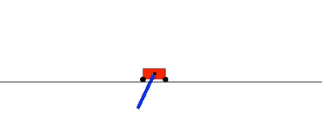

# L46 Project Code

This repo contains code based on research materials released by members of the Google Brain team in Tokyo.
The aim of this project is to see if WANNs can be extended to other use cases such as CIFAR10 classifcation and GANs. We also went through all the source code in an attempt to gain a deeper understanding of the relevant materials.
Practically all of the changes we made are in the WANNRelease/WANN, as the other materials are not that relevant to our project.

## Original project ##

### Weight Agnostic Neural Networks ###

  </img>

[Code Release](https://github.com/google/brain-tokyo-workshop/tree/master/WANNRelease)

[Link to Article](https://weightagnostic.github.io/) ([pdf version](https://arxiv.org/abs/1906.04358))

## Disclaimer

This is not an official Google product.
